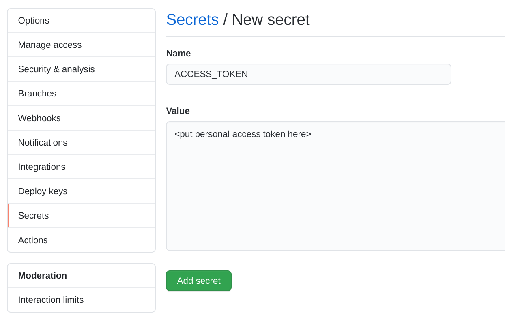
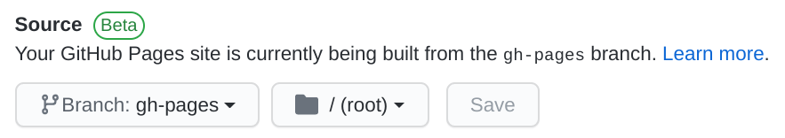

Hey look I have a fancy new website! 🦄🤖🚀

What you're reading right now was built and deployed using:
* [Gatsby](https://www.gatsbyjs.org/) - A static site generator
* [GitHub Pages](https://pages.github.com/) - Host sites from a git repository
* [GitHub Actions](https://github.com/features/actions) - Automate rebuilding the website whenever changes are pushed to master

There are plenty of resources out there explaining how to set up a website like this, but I figured it'd be nice to gather it into one how-to. I'm sure it'll be _real_ helpful when I forget how this all works in a few months 😅.

<!--more-->

### Step 1: Initialize a New Gatsby Site

It's super easy to get started with [Gatsby](https://www.gatsbyjs.org/). Honestly, the hardest part about it was figuring out a theme or starter to use.

At first I really liked [this one](https://github.com/alxshelepenok/gatsby-starter-lumen), but the file structure of it started to rub me the wrong way. There's a lot code in there, how do I update it if the starter gets updated? Do I fork it? Am I going to have deal with merge conflicts?

I switched to [this theme](https://github.com/LekoArts/gatsby-themes/tree/master/themes/gatsby-theme-minimal-blog). It's nice and simple. The only things in my repo are content (if I had any) and site settings. Getting updates from upstream is just a matter of updating the npm package:

```json noLineNumbers
  "dependencies": {
    "@lekoarts/gatsby-theme-minimal-blog": "^2.4.0",
```

### Step 2: Create a Repository on GitHub

Create a new repository on GitHub and push your new gatsby site to it. If you want GitHub Pages to host your website at `<your-username>.github.io`, you **must** name the repo `<your-username>.github.io`. For example, the repo for this website is named [`mattbun.github.io`](https://github.com/mattbun/mattbun.github.io).

### Step 3: Set Up GitHub Actions

So now the code is on GitHub. But wait, doesn't this repo _only_ have markdown? How do we compile it and get it deployed?

That's where GitHub Actions comes in. We'll use it to automatically build the site and push the compiled site to a `gh-pages` branch whenever the `master` branch is pushed to.

[Someone already made an action to do this](https://github.com/marketplace/actions/gatsby-publish), so all you need is this in `.github/workflows`:

```yaml:title=.github/workflows/publish.yml
name: Gatsby Publish

on:
  push:
    branches:
      - master

jobs:
  build:
    runs-on: ubuntu-latest
    steps:
      - uses: actions/checkout@v1
      - uses: enriikke/gatsby-gh-pages-action@v2
        with:
          access-token: ${{ secrets.ACCESS_TOKEN }}
          deploy-branch: gh-pages
```

Before you go and push this change, note that it requires a secret named `ACCESS_TOKEN`. It needs that token to push changes to your repo.

You'll need to generate a personal access token with `repo` scope. See [here](https://docs.github.com/en/github/authenticating-to-github/creating-a-personal-access-token) for instructions on how to do that. Copy the token, open your repository's settings, go to the "Secrets" tab, and create a new secret named `ACCESS_TOKEN` with the token you copied.



With the secret in place, go ahead and push those changes. Go to the "Actions" tab in GitHub and you can watch the build in action. Assuming it completes successfully, you'll find there's a new `gh-pages` branch with your compiled website ([like this](https://github.com/mattbun/mattbun.github.io/tree/gh-pages)). We're almost there!

### Step 4: Enable GitHub Pages

Now you just need to [enable Github Pages](https://docs.github.com/en/github/working-with-github-pages/configuring-a-publishing-source-for-your-github-pages-site) on this repository. Click the Settings tab and scroll all the way down to the "GitHub Pages" section. Choose your new `gh-pages` branch and hit save!



### Step 5: Try it Out!

That should be it! Open up your website at `<username>-github.io` and it should be up and running! 🎉💃

### Bonus: Using a Custom Domain

In addition to [mattbun.github.io](https://mattbun.github.io), I updated my domain [rathbun.dev](https://rathbun.dev) to point to it as well. [These instructions](https://docs.github.com/en/github/working-with-github-pages/managing-a-custom-domain-for-your-github-pages-site#configuring-an-apex-domain) show you how to do it. My domain is registered through Google Domains and my DNS settings there look something like this:


Be sure to put your domain name in a file named `CNAME` in the root directory on your master branch. GitHub will try to add it to your `gh-pages` branch but the Gatsby Publish action will overwrite it. If you put it in master, the action [will copy the file over when it deploys](https://github.com/marketplace/actions/gatsby-publish#cname).
