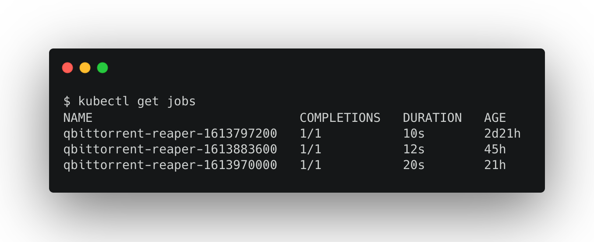

My new Raspberry Pi cluster is a little unstable and pretty limited since the nodes have just 1GB of memory. What the heck could I possibly use this for?

Turns out it's great at running simple cron jobs. In this case, one that cleans up old torrents on a remote qbittorrent server.

<!--more-->

# The Problem

I download a lot of uhh... _linux distributions_ using qbittorrent. One thing that's always bugged me about it is that it doesn't automatically remove old downloads. My home server is completely automated _except_ it won't clean these up.

This isn't just a problem with qbittorrent, I've wanted this on every bittorrent client I've used. There _has_ to be a way to do this.

# The Solution

qbittorrent has an API! It's kind of hard to find since their wiki seems to be world writable ([?](https://github.com/qbittorrent/qBittorrent/wiki/Web-API-Documentation)) but [eventually you'll find it](https://github.com/qbittorrent/qBittorrent/wiki/Web-API-Documentation/87ec6b289ea5376b648e8cbb1373fb538da9f01d). There's even [an npm package](https://www.npmjs.com/package/qbittorrent-api-v2), though I didn't have great luck with that.

Anyway, once I found the API documentation, I was able to put this together:

## Introducing qbittorrent-reaper

**[qbittorrent-reaper](https://github.com/mattbun/qbittorrent-reaper)** is a simple Node.js application, written in Typescript, that removes torrents older than a given age from qbittorrent.

You can find a docker image for it [here](https://hub.docker.com/r/mattbun/qbittorrent-reaper)!

### How Do You Run It on a Schedule?

qbittorrent-reaper won't run on a schedule on its own. It's meant to be run as a Kubernetes CronJob. I'm planning on putting up a helm chart for it, but for now you could run the following with `kubectl apply`:

```yaml
apiVersion: batch/v1beta1
kind: CronJob
metadata:
  name: qbittorrent-reaper
spec:
  schedule: "0 0 * * *" # daily at midnight
  concurrencyPolicy: Replace
  jobTemplate:
    spec:
      template:
        spec:
          restartPolicy: OnFailure
          containers:
          - name: qbittorrent-reaper
            image: mattbun/qbittorrent-reaper:main
            env:
              - name: QBITTORRENT_HOST
                value: 192.168.1.x
              - name: QBITTORRENT_PORT
                value: 8080
              - name: QBITTORRENT_USERNAME
                value: totallyCoolUsername
              - name: QBITTORRENT_PASSWORD
                value: "this shouldn't be here"
              - name: MAX_TORRENT_AGE
                value: 2w
```

(you probably don't want the password exposed like that)

### Does It Run on ARM Processors?

The [new docker/build-push-action/v2 action](https://www.docker.com/blog/docker-v2-github-action-is-now-ga/) makes it super easy to build the image for multiple CPU architectures (including my cluster's `arm/v7` 🎉). It's as easy as this:

```yaml
- name: Set up QEMU
  uses: docker/setup-qemu-action@v1

- name: Set up Docker Buildx
  uses: docker/setup-buildx-action@v1

- name: Login to DockerHub
  uses: docker/login-action@v1
  with:
    username: ${{ secrets.DOCKERHUB_USERNAME }}
    password: ${{ secrets.DOCKERHUB_TOKEN }}

- name: Build and push
  uses: docker/build-push-action@v2
  with:
    context: .
    file: ./Dockerfile
    platforms: linux/amd64,linux/arm/v7,linux/arm64
    push: true
    tags: |
      mattbun/qbittorrent-reaper:latest
      mattbun/qbittorrent-reaper:main
      mattbun/qbittorrent-reaper:${{ github.event.release.tag_name }}
```

### Also I'd Like to Point Out...

Versioning and releases are handled automatically by [semantic-release](https://github.com/semantic-release/semantic-release) as long as I remember to stick to semantic commits. This means that the whole release process is automated! Whenever I push a commit to `main` that `semantic-release` deems worthy of a version bump, it creates a release in github and builds a new docker image.

I'm _really_ excited about this. I might just make a template out of it.

# Back to the cluster

Turns out my slightly unstable cluster is perfect for running this:



This has been working great for the last few weeks now. Old torrents are getting removed and my cluster has that warm feeling of accomplishment. Win win.
